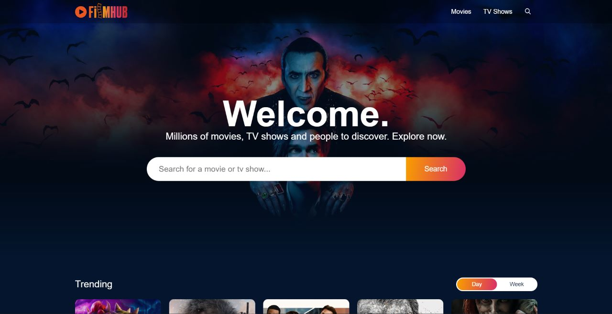
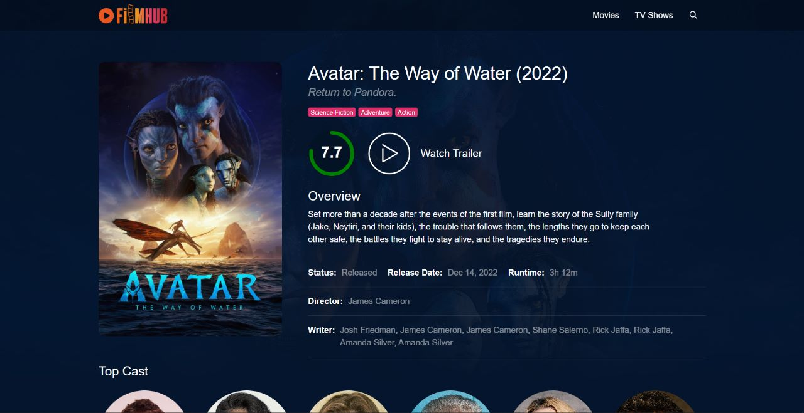
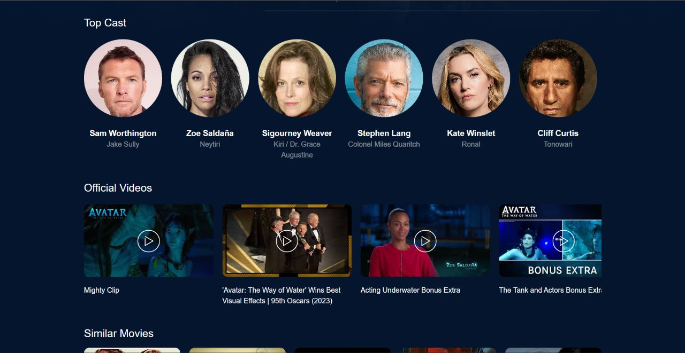
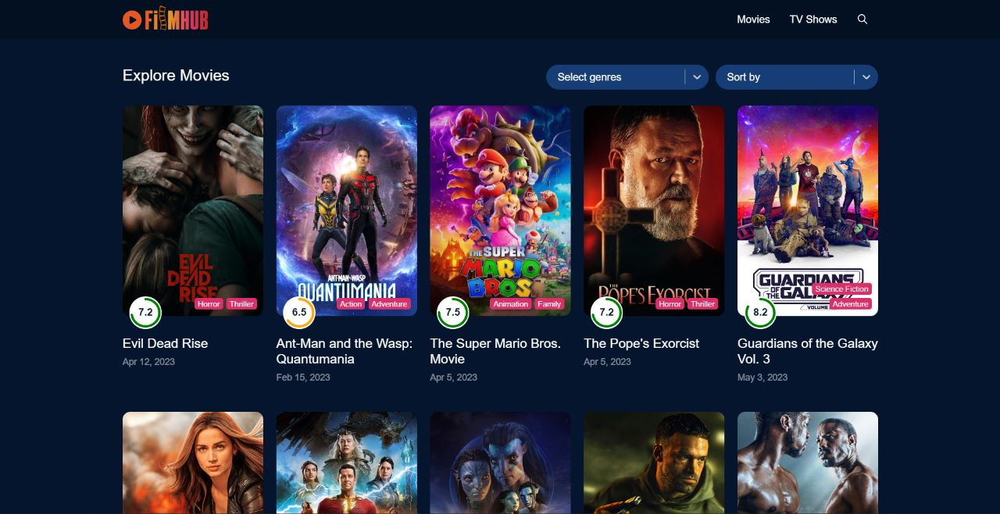
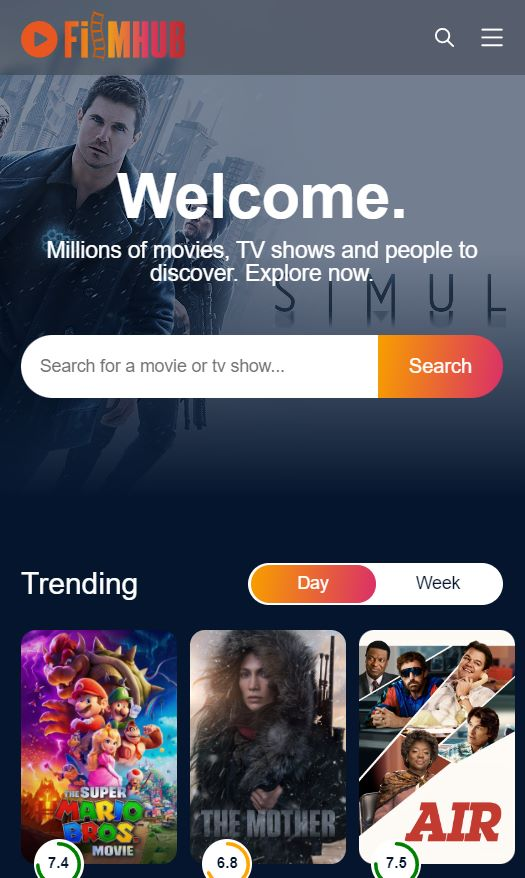
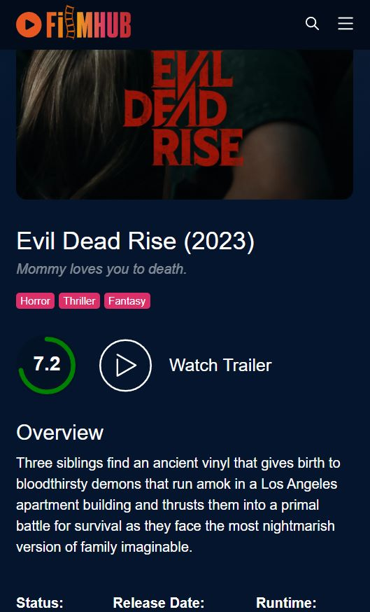
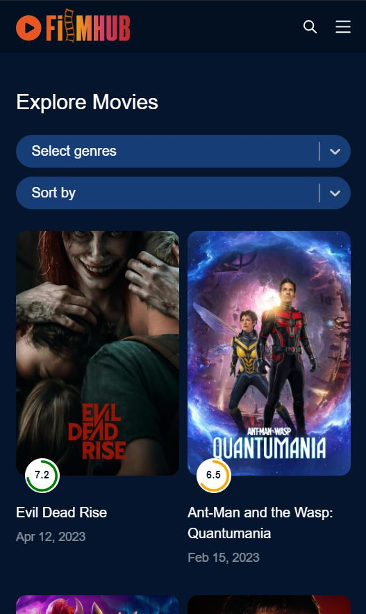

# FilmHub

O projeto é uma página de filmes inspirada na experiência da Netflix utilizando a API do TMDB para o catálogo de filmes. É um ambiente digital onde os usuários podem descobrir e explorar uma vasta coleção de filmes, séries e documentários. Com uma interface intuitiva e atraente, os visitantes podem navegar por diversas categorias, como Ação, Romance, Comédia, Terror e muitas outras para encontrar conteúdos de seu interesse.

## Tecnologias utilizadas:
- React
- Typescript
- Styled Components
- Redux
- Axios
- React Router Dom
- API - TMDB

Você pode ver mais sobre o projeto neste link: [Filmhub](https://project-film-hub.vercel.app/)

## Layout - Desktop

|Home|Details|
|---|---|
| |  

|Details Info|Explore Movies|
---|---|
|  | 

## Layout - Mobile

|Home|Details|Explore Movies|
|---|---|---|
| |  |  
---


## 🚀 Começando

Pra começar, primeiro clone o repositório do projeto pra sua máquina

```
$ git clone https://github.com/Vinicius-Rubia/FilmHub.git
```

## ⚙️ Iniciando o Projeto

Para iniciar, execute os seguintes comandos em seu terminal:

```
$ cd FilmHub -> Mudar para o diretório do projeto
```

```
$ npm install -> Instalar todas as dependências

ou então...

$ yarn -> Instalar todas as dependências
```

```
$ npm run dev -> Iniciar o projeto

ou então...

$ yarn run dev -> Iniciar o projeto
```

⌨️ com ❤️ por [Vinicius Rubia](https://github.com/Vinicius-Rubia) 😊
